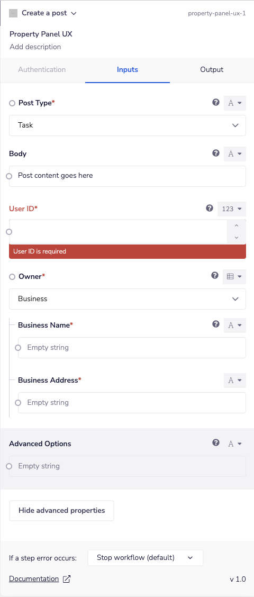

# CDK-examples-public

This repository contains examples of connectors built using Tray.io's [CDK](https://developer.tray.io/developer-portal/cdk/introduction/).

1. tmdb: This connector is demonstrated in the [Quickstart tutorial](https://developer.tray.io/developer-portal/cdk/quickstart/) and its' follow up tutorial on Dynamic dropdown lists.
2. composite-example: this connector includes 3 operations, each with varying levels of complexity ([Documentation for Composite Implementation](https://developer.tray.io/developer-portal/cdk/dsl-reference/#composite-implementation)). Composite operations are most suited to non-http operations (such as data transformation) or complex http operations that require multiple steps or multiple http requests with conditional logic.
   - `convert_json_to_xml` is a composite operation that demonstrates a basic use case. It uses the `xml-js` library to convert a JSON string to an XML string.
   - `generate_sha_256_hash` is a composite operation that demonstrates a more complex use case. It uses the `crypto` library to generate a SHA-256 hash from a given string.
   - `create_or_update_post` is a complex composite operation that demonstrates a use case that conditionally makes a POST or PUT request based on the existence of a post with a given ID. If the post `id` exists as an input property, the operation makes a PUT request to update the post. If the post `id` does not exist as an input property, the operation makes a POST request to create a new post.

3. ddl-example: this connector includes 3 operations that demonstrate how to create and use a authenticated ddl.
([Documentation for DDL Implementation](https://developer.tray.io/developer-portal/cdk/dsl-reference/#ddl-dynamic-dropdown-lists)).

4. property-panel-ux: An example connector showing how to use UI features in the property panel, including: field titles, descriptions (i.e. tooltips), default values, advanced properties, enums (i.e. static dropdowns) and oneOf (i.e. dropdowns).

5A. file-handling-example: this connector utilises dropbox API to show an example of uploading a file, and downloading a file.
([Documentation for File Handling](https://developer.tray.io/developer-portal/cdk/guides/file-handling/file-handling/)).

5B. multipart-file-handling-example: this connector utilises imgur API to show an example of multipart uploading with a file.
([Documentation for File Handling](https://developer.tray.io/developer-portal/cdk/guides/file-handling/file-handling/)).

6. Error Handling Example: An example connector that demonstrates how to setup the error handler with JSON decoding and then use the body contents when returning an error to the user.

7. Github actions deployment pipeline: An example CI pipeline that deploys connectors using the CDK deployment API, [more info here](github-actions-deployment-pipeline/README.md)
